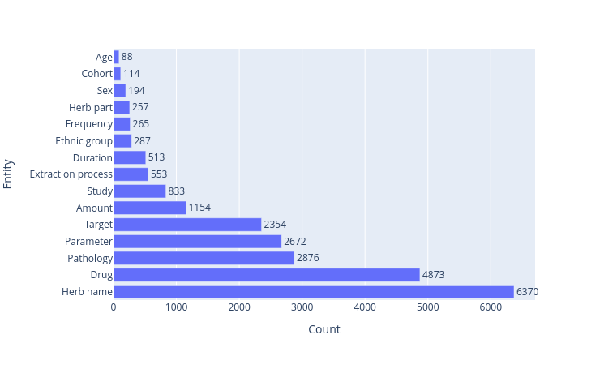
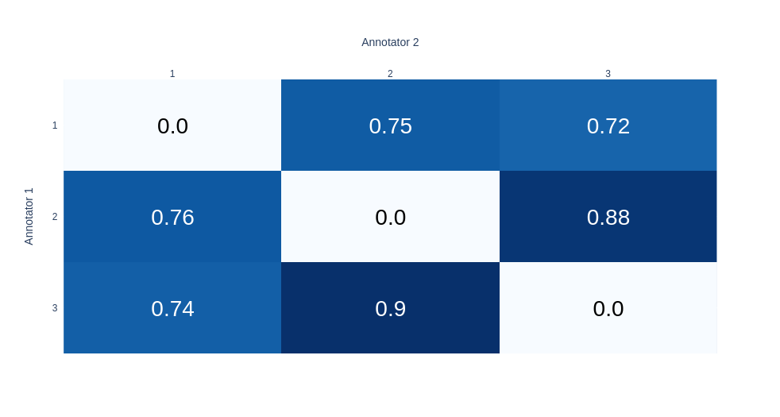

# Herb-Drug Interactions dataset

This dataset covers the field of Herb-Drug Interactions (DDI). It includes 11131 sentences containing annotations on herbs and drugs, but also on any element relevant to the context of the interaction. This includes:
**Ethnic group, Pathology, Age, Frequency, Duration, Herb name, Cohort, Target, Sex, Study, Drug, Parameter, Extraction process, Herb part, Amount**

More information about these labels are available in the annotation guide. The number of occurrences of each label is showed in the figure below.  

All sentences are extracted from full-text articles obtained from PubMed Central. Full-text are extracted using NCBI Entrez e-utils, and sentence-tokenized using NLTK tokenizer. This method was chosen to reflect a realistic data extraction process from the PubMed database.

This dataset was annotated by 3 pharmacists, selected out from a pool of 6 after two test phases. Inter-annotator agreement, in the form of Pairwise F1 score, is shown below.

